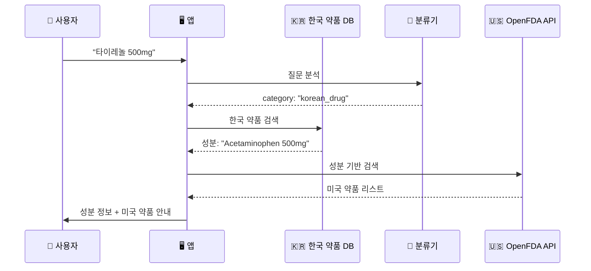

# 한국 약품 → 해외 약품 매칭 시스템 개선 방안

## 배경

현재 프로젝트는 OpenFDA API를 활용하여 미국 FDA 승인 약품 정보를 제공합니다. 사용자의 목표는 **한국 약품명을 입력하면 해당 약의 성분을 추출하여, 해외(미국)에서 동일 성분으로 구매 가능한 약품을 안내**하는 것입니다.

### 핵심 과제
1. 한국 약품 데이터베이스 확보 및 통합
2. 한글 약품명 → 성분명(영문) 매핑
3. 성분 기반 OpenFDA 검색
4. 의료법 준수 (처방전 필요 여부 안내)

---

## 제안하는 솔루션

### 🎯 전체 워크플로우



---

## 📋 구현 방안

### 1단계: 한국 약품 데이터 확보 ⭐ 최우선

#### 옵션 A: 공공 API 활용 (추천)

**식품의약품안전처 공공데이터 포털**
- **API**: [의약품개요정보(e약은요)](https://www.data.go.kr/data/15075057/openapi.do)
- **제공 정보**: 제품명, 성분명(한글/영문), 효능효과, 용법용량
- **장점**: 공식 데이터, 무료, 실시간 업데이트
- **단점**: API 키 신청 필요, 응답 속도

**활용 예시**:
```python
# 식약처 API 호출
def search_korean_drug(product_name: str) -> dict:
    """
    한국 약품명으로 성분 정보 검색
    
    Returns:
        {
            "product_name": "타이레놀정500밀리그램",
            "ingredients": [
                {"name_kor": "아세트아미노펜", "name_eng": "Acetaminophen", "amount": "500mg"}
            ],
            "manufacturer": "한국얀센",
            "prescription_required": False
        }
    """
```

#### 옵션 B: 크롤링 + 로컬 DB (대안)

- **출처**: 드럭인포(druginfo.co.kr), 킴스온라인(kimsonline.co.kr)
- **방법**: 주요 약품 정보 크롤링 → JSON/SQLite 저장
- **장점**: 빠른 응답, API 제한 없음
- **단점**: 법적 이슈 가능성, 데이터 업데이트 필요

#### 옵션 C: 하이브리드 (최적)

1. 자주 검색되는 약품 500개 → 로컬 캐시
2. 없으면 식약처 API 호출
3. 결과를 캐시에 저장

---

### 2단계: 분류기 개선

현재 분류기에 **한국 약품명 감지** 카테고리 추가:

```python
# src/chain/prompts.py 수정

CLASSIFIER_PROMPT = """
당신은 의약품 질문 분류 전문가입니다.

질문 카테고리:
1. korean_drug: 한국 약품명 (예: "타이레놀", "게보린", "판피린")
2. brand_name: 미국 브랜드명 (예: "Tylenol", "Advil")
3. generic_name: 성분명 (예: "Acetaminophen", "Ibuprofen")
4. indication: 증상/효능 (예: "headache", "두통")
5. invalid: 의약품 무관

질문: {question}

JSON 형식으로 반환:
{{
  "category": "korean_drug",
  "keyword": "타이레놀"
}}
"""
```

---

### 3단계: RAG Chain 수정

```python
# src/chain/rag_chain.py 수정

def prepare_context(question: str) -> dict:
    # 1. 질문 분류
    classification = classify(question)
    
    # 2. 한국 약품인 경우
    if classification["category"] == "korean_drug":
        # 2-1. 한국 약품 DB에서 성분 검색
        kr_drug_info = search_korean_drug(classification["keyword"])
        
        if not kr_drug_info:
            return {
                "category": "korean_drug",
                "keyword": classification["keyword"],
                "context": "(해당 한국 약품 정보를 찾을 수 없습니다.)",
                "kr_drug_info": None,
                "raw_results": []
            }
        
        # 2-2. 성분명(영문)으로 OpenFDA 검색
        ingredients = kr_drug_info["ingredients"]
        main_ingredient = ingredients[0]["name_eng"]  # 주성분
        
        fda_results = search_by_generic_name(main_ingredient)
        context = format_label_results(fda_results)
        
        return {
            "category": "korean_drug",
            "keyword": classification["keyword"],
            "kr_drug_info": kr_drug_info,
            "context": context,
            "raw_results": fda_results
        }
    
    # 3. 기존 로직 (미국 약품)
    else:
        # ... 기존 코드 유지
```

---

### 4단계: 답변 프롬프트 개선

```python
# src/chain/prompts.py

ANSWER_PROMPT_KOREAN_DRUG = """
당신은 해외 여행자를 위한 약품 안내 전문가입니다.

【한국 약품 정보】
- 제품명: {kr_product_name}
- 주성분: {kr_ingredient_kor} ({kr_ingredient_eng})
- 함량: {kr_amount}
- 처방전 필요: {prescription_required}

【미국에서 구매 가능한 동일 성분 약품】
{fda_context}

사용자 질문: {question}

다음 형식으로 답변하세요:

## 💊 한국 약품 정보
- **제품명**: [한국 제품명]
- **주성분**: [성분명 한글] ([성분명 영문])
- **용도**: [간단한 효능]

## 🇺🇸 미국에서 구매 가능한 약품

### 1. [미국 브랜드명]
- **성분**: [동일 성분 확인]
- **용량**: [용량 정보]
- **구매 방법**: [OTC/처방전 필요]

### 2. [다른 브랜드명]
...

## 📋 약사에게 보여줄 정보
```
I need medication containing [영문 성분명] [용량]
(예: Acetaminophen 500mg)
```

## ⚠️ 주의사항
- 처방전 필요 여부 확인
- 용량 차이 주의
- 알레르기 확인
"""
```

---

### 5단계: UI 개선

```python
# app.py 수정

# 사이드바에 한국 약품 검색 가이드 추가
with st.sidebar:
    st.markdown("### 🇰🇷 한국 약품 검색")
    st.info("""
    한국 약품명을 입력하면:
    1. 해당 약의 성분 정보 제공
    2. 미국에서 구매 가능한 동일 성분 약품 안내
    3. 약사에게 보여줄 영문 성분 정보 제공
    """)
    
    example_questions = [
        "타이레놀 500mg 미국에서 뭐 사야해?",
        "게보린 성분이 뭐야?",
        "판피린과 같은 성분의 미국 약은?"
    ]
```

---

## 🚨 의료법 및 법적 고려사항

### 1. 면책 조항 강화

현재 면책 조항에 추가:

```markdown
## 해외 의약품 구매 관련 주의사항

- 본 서비스는 성분 정보만 제공하며, 특정 약품 구매를 권장하지 않습니다
- 해외 의약품 구매 시 현지 법규를 반드시 확인하세요
- 처방전이 필요한 약품은 의사 상담 후 구매하세요
- 개인 사용 목적의 소량 구매만 허용됩니다 (한국 관세법)
```

### 2. 처방전 필요 여부 명시

```python
def format_answer_with_prescription_info(fda_results):
    """
    OTC vs Prescription 명확히 구분
    """
    for drug in fda_results:
        product_type = drug.get("openfda", {}).get("product_type", [])
        
        if "PRESCRIPTION" in str(product_type).upper():
            prescription_status = "⚠️ 처방전 필요 (Prescription Required)"
        else:
            prescription_status = "✅ 일반의약품 (Over-The-Counter)"
```

---

## 📊 예상 사용 시나리오

### 시나리오 1: 일반의약품 (타이레놀)

**입력**: "타이레놀 500mg 미국에서 뭐 사야 해?"

**출력**:
```
💊 한국 약품 정보
- 제품명: 타이레놀정 500mg
- 주성분: 아세트아미노펜 (Acetaminophen) 500mg
- 용도: 해열, 진통

🇺🇸 미국에서 구매 가능한 약품

1. Tylenol Regular Strength
   - 성분: Acetaminophen 325mg
   - 구매: ✅ 약국/마트에서 자유 구매 가능

2. Tylenol Extra Strength
   - 성분: Acetaminophen 500mg
   - 구매: ✅ 약국/마트에서 자유 구매 가능

📋 약사에게 보여줄 정보
"I need Acetaminophen 500mg for pain relief"
```

### 시나리오 2: 전문의약품

**입력**: "한국에서 먹던 고혈압약 성분 알려줘"

**출력**:
```
⚠️ 전문의약품 안내

이 약은 처방전이 필요한 전문의약품입니다.
미국에서 구매하려면:

1. 현지 의사 진료 필요
2. 또는 한국 처방전 영문 번역본 지참
3. 약사와 상담 필수

성분 정보: [성분명]
```

---

## 🛠️ 구현 우선순위

### Phase 1: MVP (2-3일)
- [ ] 식약처 API 연동 (또는 주요 약품 100개 하드코딩)
- [ ] 분류기에 `korean_drug` 카테고리 추가
- [ ] 기본 성분 매칭 로직 구현
- [ ] 간단한 답변 포맷 적용

### Phase 2: 개선 (1주)
- [ ] 로컬 캐시 시스템 구축
- [ ] 답변 프롬프트 최적화
- [ ] 처방전 필요 여부 자동 판별
- [ ] UI 개선 (한/영 토글 등)

### Phase 3: 고도화 (2주)
- [ ] 다성분 약품 처리 (복합제)
- [ ] 용량 환산 기능 (mg ↔ mcg)
- [ ] 대체 약품 추천
- [ ] 다국어 지원 (일본, 유럽 등)

---

## 💡 핵심 개선 포인트

### 1. 기존 장점 유지
- ✅ Router 패턴 활용
- ✅ OpenFDA API 실시간 검색
- ✅ 스트리밍 응답

### 2. 새로운 가치 추가
- 🆕 한국 약품 → 해외 약품 브릿지
- 🆕 성분 기반 매칭
- 🆕 여행자 맞춤 정보 제공

### 3. 답변 관련성 개선
- 현재 문제점(Answer Relevancy 0.113) 해결
- 사용자 의도에 맞는 간결한 답변
- "약사에게 보여줄 정보" 섹션으로 실용성 강화

---

## 📁 수정 필요 파일

### 신규 파일
- `src/api/korean_drug_client.py` - 식약처 API 클라이언트
- `src/api/korean_drug_cache.json` - 로컬 캐시
- `src/chain/prompts_korean.py` - 한국 약품용 프롬프트

### 수정 파일
- `src/chain/prompts.py` - 분류기 프롬프트
- `src/chain/rag_chain.py` - 한국 약품 처리 로직
- `app.py` - UI 개선

---

## 🔗 참고 자료

### 한국 약품 데이터
- [식약처 의약품통합정보시스템](https://nedrug.mfds.go.kr)
- [공공데이터포털 - 의약품개요정보](https://www.data.go.kr/data/15075057/openapi.do)

### 법적 참고
- [해외여행자 의약품 휴대 안내](https://www.mfds.go.kr)
- [미국 FDA - Traveling with Medication](https://www.fda.gov/consumers/consumer-updates/5-tips-traveling-us-medications)

---

## ✅ 다음 단계

1. **식약처 API 키 발급** (1-2일 소요)
2. **주요 약품 100개 리스트 작성** (타이레놀, 게보린, 판피린 등)
3. **프로토타입 구현** (Phase 1)
4. **테스트 및 피드백**
