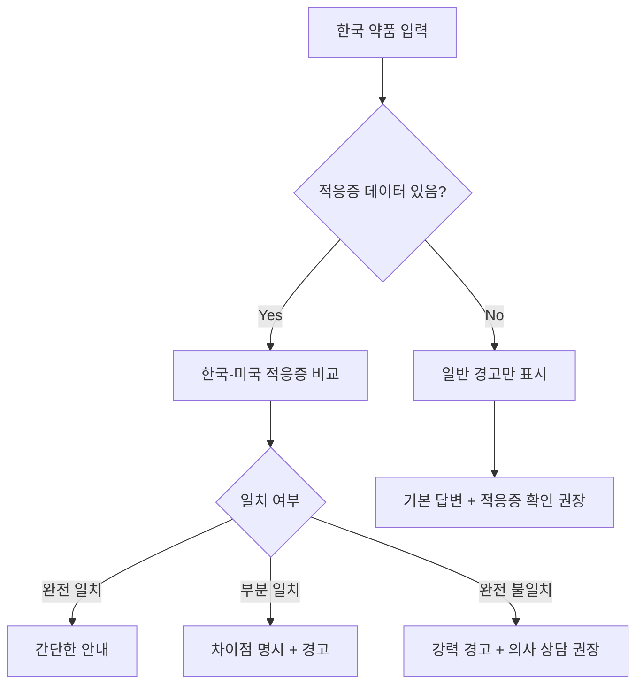

# 한국-미국 의약품 효능(적응증) 승인 차이 분석

## 🎯 핵심 질문

**"한국의 약들은 모두 FDA의 승인된 효능으로 똑같이 승인이 된 거야? 아니면 한국에서는 다른 효능으로 승인이 난 약도 있어?"**

---

## ⚠️ 결론부터 말하면

**아니요, 동일 성분이라도 한국과 미국에서 승인된 효능(적응증)이 다를 수 있습니다.**

### 주요 이유

1. **규제 기관이 다름** (식약처 vs FDA)
2. **임상 데이터 요구사항 차이**
3. **인구 특성 및 질병 유병률 차이**
4. **승인 시기 차이** (Drug Lag)
5. **각국의 의료 환경 및 정책**

---

## 📊 실제 사례: Semaglutide (세마글루타이드)

### 성분 개요
- **약리 작용**: GLP-1 수용체 작용제
- **주요 효과**: 혈당 조절, 식욕 억제, 체중 감소

### 미국 FDA 승인 ✅

| 제품명 | 승인 적응증 | 비고 |
|--------|------------|------|
| **Ozempic** | 제2형 당뇨병 치료 | 주사제 |
| **Wegovy** | **비만 치료** (체중 관리) | 주사제 |
| **Rybelsus** | 제2형 당뇨병 치료 | 경구제 |

### 한국 식약처 승인 ⚠️

| 제품명 | 승인 적응증 | 비고 |
|--------|------------|------|
| **오젬픽** | 제2형 당뇨병 치료 | 2022년 4월 승인 |
| **위고비** | **비만 치료 승인 불명확** | 보험 급여 미적용 |

### 차이점 분석

```
동일 성분 (Semaglutide)

미국 🇺🇸:
├─ 당뇨병 치료 ✅ (Ozempic, Rybelsus)
└─ 비만 치료 ✅ (Wegovy) ← FDA 명시적 승인

한국 🇰🇷:
├─ 당뇨병 치료 ✅ (오젬픽)
└─ 비만 치료 ❓ (위고비 승인 여부 불명확, 보험 미적용)
```

> **중요**: 같은 성분이지만 **미국에서는 비만 치료제로 명확히 승인**되었으나, **한국에서는 당뇨병 치료제로만 승인**되었거나 비만 적응증 승인이 제한적일 수 있습니다.

---

## 🔬 효능 차이가 발생하는 이유

### 1. 임상 시험 데이터 차이

#### 미국 FDA
- 글로벌 임상 데이터 수용
- 다국적 임상시험 결과 인정
- 빠른 승인 절차

#### 한국 식약처
- **한국인 대상 임상 데이터 요구** (특히 생물학적 제제)
- 서구 기준 임상 데이터 추가 검증
- 승인 지연 (Drug Lag 평균 493일)

### 2. 인구 특성 차이

| 요인 | 한국 | 미국 | 영향 |
|------|------|------|------|
| **비만율** | 낮음 (5-6%) | 높음 (40%+) | 비만 치료제 수요 차이 |
| **당뇨병 유형** | 아시아형 당뇨 | 비만형 당뇨 | 약물 효능 차이 가능 |
| **체질량지수** | 낮음 | 높음 | 용량 조절 필요 |

> **예시**: 비만 치료제는 미국에서 수요가 높아 빠르게 승인되지만, 한국에서는 우선순위가 낮을 수 있음

### 3. 의료 정책 차이

#### 미국
- 시장 중심 (Market-driven)
- 환자 선택권 강조
- 빠른 신약 도입

#### 한국
- 건강보험 중심
- 비용-효과성 평가 중시
- 보수적 승인 정책

---

## 💊 다른 사례들

### 사례 1: Adalimumab (아달리무맙, Humira)

**미국 FDA 승인 적응증**:
- 류마티스 관절염
- 소아 특발성 관절염
- 건선성 관절염
- 강직성 척추염
- 크론병
- 궤양성 대장염
- 판상 건선
- 화농성 한선염
- 포도막염

**한국 식약처 승인**:
- 궤양성 대장염 (확인됨)
- 기타 적응증 승인 범위 상이 가능

### 사례 2: Bevacizumab (베바시주맙)

**미국 FDA**:
- 자궁경부암
- 대장암
- 교모세포종
- 폐암
- 난소암
- 신장암
- 간암

**한국 식약처**:
- 진행성 자궁경부암 (국민건강보험 급여)
- 기타 암종 승인 범위 다를 수 있음

---

## 🚨 프로젝트에 미치는 영향

### 문제 상황

```
사용자: "한국에서 먹던 위고비(비만약) 미국에서 구매하고 싶어요"

현재 시스템 (문제):
1. 성분 검색: Semaglutide ✅
2. OpenFDA 검색: Wegovy 발견 ✅
3. 답변: "Wegovy를 구매하세요" ✅

하지만...
⚠️ 한국에서는 비만 적응증 승인 안 됐을 수 있음!
⚠️ 사용자가 한국에서 "당뇨약"으로 처방받았을 수도 있음
⚠️ 효능이 다르다는 경고 없음
```

### 해결 방안

#### 1. 적응증 비교 경고 시스템

```python
def compare_indications(kr_drug_info: dict, us_drug_info: dict) -> dict:
    """
    한국과 미국의 승인 적응증 비교
    """
    kr_indications = set(kr_drug_info.get("indications", []))
    us_indications = set(us_drug_info.get("indications_and_usage", []))
    
    # 공통 적응증
    common = kr_indications & us_indications
    
    # 미국만 승인
    us_only = us_indications - kr_indications
    
    # 한국만 승인
    kr_only = kr_indications - us_indications
    
    return {
        "match_status": "full" if kr_only == us_only == set() else "partial",
        "common_indications": list(common),
        "us_only_indications": list(us_only),
        "kr_only_indications": list(kr_only),
        "warning_needed": len(us_only) > 0 or len(kr_only) > 0
    }
```

#### 2. 답변 템플릿 개선

```markdown
## 💊 한국 약품: 위고비

**한국 승인 적응증**: 
- ⚠️ 제2형 당뇨병 치료 (오젬픽으로 승인)
- ❌ 비만 치료 (승인 불명확 또는 보험 미적용)

## 🇺🇸 미국 약품: Wegovy

**미국 승인 적응증**:
- ✅ 만성 체중 관리 (비만 치료)
- ✅ 제2형 당뇨병 치료 (Ozempic)

## ⚠️ 중요 경고

### 적응증 차이
**한국과 미국의 승인 효능이 다릅니다!**

- 한국: 주로 당뇨병 치료 목적
- 미국: 비만 치료 + 당뇨병 치료 모두 승인

### 주의사항
1. 한국에서 **당뇨병 치료**로 처방받았다면 → Ozempic 구매
2. 한국에서 **비만 치료** 목적이었다면 → 미국에서는 Wegovy 구매 가능
3. 반드시 약사에게 **사용 목적**을 명확히 설명하세요

### 처방전 필요 여부
- 미국: Wegovy는 **처방전 필수** (Prescription Required)
- 의사 진료 후 처방받아야 함
```

---

## 📋 구현 권장 사항

### 1. 적응증 데이터 수집

#### 한국 약품 DB에 포함할 정보
```json
{
  "product_name": "오젬픽주",
  "ingredients": [
    {"name_eng": "Semaglutide", "amount": "0.5mg/1.5mL"}
  ],
  "approved_indications": [
    "제2형 당뇨병"
  ],
  "off_label_uses": [
    "비만 치료 (보험 미적용)"
  ],
  "prescription_required": true
}
```

#### OpenFDA 데이터 활용
```python
def extract_fda_indications(fda_result: dict) -> list[str]:
    """
    OpenFDA 결과에서 적응증 추출
    """
    indications_raw = fda_result.get("indications_and_usage", [])
    
    # 텍스트 정제 및 주요 적응증 추출
    indications = []
    for text in indications_raw:
        # 예: "indicated for the treatment of type 2 diabetes"
        # → "Type 2 Diabetes"
        cleaned = extract_indication_keywords(text)
        indications.extend(cleaned)
    
    return indications
```

### 2. 경고 레벨 시스템

```python
class IndicationWarningLevel:
    NONE = 0        # 완전 일치
    MINOR = 1       # 일부 차이 (부차적 적응증)
    MODERATE = 2    # 주요 적응증 일부 다름
    MAJOR = 3       # 완전히 다른 적응증
    CRITICAL = 4    # 한국 미승인, 미국만 승인

def determine_warning_level(comparison: dict) -> int:
    """
    적응증 비교 결과로 경고 레벨 결정
    """
    if comparison["match_status"] == "full":
        return IndicationWarningLevel.NONE
    
    us_only = comparison["us_only_indications"]
    kr_only = comparison["kr_only_indications"]
    
    # 미국에만 승인된 주요 적응증 있음
    if len(us_only) > 0:
        return IndicationWarningLevel.CRITICAL
    
    # 한국에만 승인된 적응증 있음
    if len(kr_only) > 0:
        return IndicationWarningLevel.MODERATE
    
    return IndicationWarningLevel.MINOR
```

### 3. 답변 생성 로직

```python
def generate_answer_with_indication_warning(
    kr_drug_info: dict,
    us_drug_info: dict,
    comparison: dict
) -> str:
    """
    적응증 차이 경고를 포함한 답변 생성
    """
    warning_level = determine_warning_level(comparison)
    
    if warning_level >= IndicationWarningLevel.MODERATE:
        warning_section = f"""
## ⚠️ 적응증 차이 경고

**한국과 미국의 승인 효능이 다릅니다!**

### 한국 승인 적응증
{format_indications(kr_drug_info["approved_indications"])}

### 미국 승인 적응증
{format_indications(us_drug_info["indications"])}

### 미국에만 승인된 효능
{format_indications(comparison["us_only_indications"])}

**중요**: 한국에서 사용하던 목적과 미국에서 구매하려는 목적이 
같은지 반드시 확인하세요!
        """
    else:
        warning_section = ""
    
    return generate_full_answer(kr_drug_info, us_drug_info, warning_section)
```

---

## 🔍 Off-Label Use (허가외 사용)

### 개념

**Off-Label Use**: 승인된 적응증이 아닌 다른 목적으로 약물 사용

### 한국과 미국의 정책

| 구분 | 한국 🇰🇷 | 미국 🇺🇸 |
|------|---------|---------|
| **의사 처방** | 허용 (의사 재량) | 허용 (의사 재량) |
| **제약사 홍보** | 금지 | 금지 |
| **과학적 논의** | 제한적 허용 (문헌 근거 필요) | 제한적 허용 |
| **소아 사용** | 많은 약물이 Off-Label | 많은 약물이 Off-Label |

### 프로젝트 영향

```
사용자: "한국에서 오젬픽을 비만 치료로 먹었어요"

시스템 판단:
1. 한국 승인 적응증: 당뇨병 ✅
2. 사용자 목적: 비만 치료 ⚠️
3. → Off-Label Use 가능성

답변:
"한국에서 비만 치료 목적으로 사용하셨다면, 이는 허가외 사용일 수 있습니다.
미국에서는 Wegovy가 비만 치료로 정식 승인되어 있으니,
의사와 상담하여 Wegovy 처방을 받으시는 것을 권장합니다."
```

---

## ✅ 최종 권장 사항

### 1. 필수 경고 사항

모든 답변에 포함:

```markdown
## ⚠️ 적응증 확인 필수

**한국과 미국의 승인 효능이 다를 수 있습니다.**

1. 한국에서 **어떤 목적**으로 사용했는지 확인
2. 미국 약품의 **승인 적응증** 확인
3. 목적이 다르면 **다른 제품** 필요할 수 있음
4. 반드시 **약사/의사와 상담**
```

### 2. 데이터 수집 우선순위

| 우선순위 | 데이터 | 출처 |
|---------|--------|------|
| **1순위** | 한국 승인 적응증 | 식약처 의약품통합정보시스템 |
| **2순위** | 미국 승인 적응증 | OpenFDA `indications_and_usage` |
| **3순위** | 처방전 필요 여부 | 양국 모두 |
| **4순위** | Off-Label 일반적 사용 | 의학 문헌 (선택) |

### 3. 답변 전략



### 4. 사용자 교육

```markdown
## 💡 알아두세요

### 같은 성분, 다른 효능?

네, 가능합니다! 예를 들어:

- **Semaglutide**
  - 한국: 당뇨병 치료
  - 미국: 당뇨병 + 비만 치료

- **Adalimumab**
  - 한국: 일부 자가면역질환
  - 미국: 더 많은 자가면역질환

### 왜 다를까요?

1. 임상 데이터 차이
2. 인구 특성 차이
3. 의료 정책 차이
4. 승인 시기 차이

### 어떻게 해야 하나요?

1. 한국에서 **어떤 증상**으로 사용했는지 기억
2. 미국 약사에게 **그 증상**을 설명
3. 약사가 적절한 약품 추천
```

---

## 🔗 참고 자료

- [식약처 의약품통합정보시스템](https://nedrug.mfds.go.kr)
- [OpenFDA Drug Label API](https://open.fda.gov/apis/drug/label/)
- [FDA Off-Label Use Policy](https://www.fda.gov/patients/learn-about-expanded-access-and-other-treatment-options/understanding-unapproved-use-approved-drugs-label)
- [한국 약사법 - 허가외 사용](https://www.law.go.kr)
